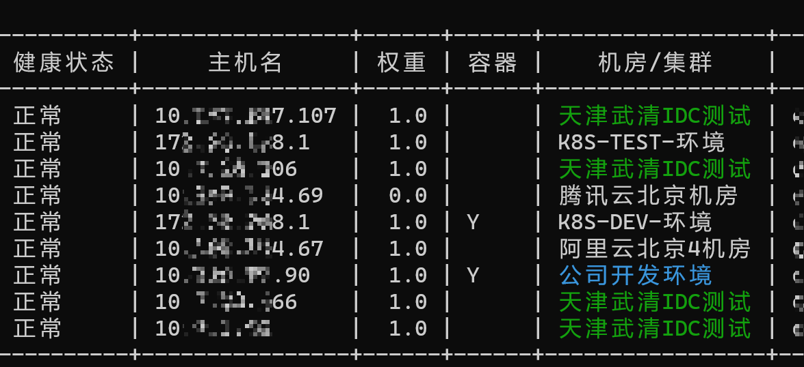

# Nacos 运维便携命令行检查工具

方便运维查看nacos注册服务，快速查找服务，同时生成prometheus自动发现所需要的json文件。   
golang 运维萌新，学习项目... 😊

首先我并不是一个专业的开发人员，我只是一个小运维，此工具只为方便工作开发，代码水平一般，大佬勿喷..........

- 支持Nacos v1 v2版本,支持集群模式
- 快速查找注册服务，支持匹配名称，命名空间，端口，ip，机房集群 多个服务模糊匹配
- 支持指定命名空间，默认全部
- 支持命令行导出json
- 支持自定义Prometheus label
- 支持Prometheus自动发现，`file_sd`和`http_sd_configs`
- 查看集群状态，以及v1升级v2接口详情
- 支持注册本身到Nacos集群
- 支持本地配置文件使用
- 支持Nacos用户名密码鉴权
- 支持自定义contextpath
- 支持Table和Markdown格式输出
- 支持实时同步nacos配置信息到本地文件
- 支持定义机房集群网段显示服务机房位置

### 安装
```shell
curl  -L https://github.com/typ431127/Nacos_check/releases/download/0.7.7/nacos-check_Linux_x86_64.tar.gz -o nacos-check_Linux_x86_64.tar.gz
tar xvf nacos-check_Linux_x86_64.tar.gz
chmod +x nacos-check
./nacos-check --url https://nacos地址
```
可以把文件放入/usr/bin或者windows path环境变量里面，随时使用cmd调用命令

### 使用帮助

```shell
Nacos

Usage:
  nacos-check [flags]
  nacos-check [command]

Available Commands:
  cluster     集群状态
  completion  Generate the autocompletion script for the specified shell
  config      查看本地配置文件路径
  config-sync 实时同步nacos配置到本地
  help        Help about any command
  register    注册本实例到Nacos并开启webapi
  version     查看版本
  web         开启web api Prometheus http_sd_configs

Flags:
      --cluster                全集群查找
      --config string          指定配置文件路径
      --contextpath string     server.servlet.contextPath (default "/nacos")
  -f, --find string            查找服务
      --group string           指定分组 多个分组 group1,group2 (default "DEFAULT_GROUP")
  -h, --help                   help for nacos-check
  -i, --ipfile string          ip解析文件 (default "salt_ip.json")
      --json                   输出json
  -l, --lable stringToString   添加标签 -l env=dev,pro=java (default [])
      --namespace string       指定命名空间ID 多个: id1,id2,id3
      --password string        密码
  -s, --second duration        监控服务间隔刷新时间 (default 5s)
      --stdout string          输出类型 table / markdown (default "table")
  -u, --url string             Nacos地址 (default "http://dev-k8s-nacos:8848")
      --username string        账户 (default "nacos")
  -w, --watch                  监控服务
  -o, --write string           导出json文件, prometheus 自动发现文件路径

Use "nacos-check [command] --help" for more information about a command.
```

#### 显示所有实例注册信息
```shell
./nacos_check-linux-amd64 --url http://nacos-0:8848 
```

#### 查看Nacos集群状态
```shell
./nacos_check-linux-amd64 --url http://nacos-0:8848 cluster --v2upgrade
```


#### 机房集群支持


#### 查找注册服务
```shell
./nacos_check-linux-amd64 --url http://nacos-0:8848 -f gateway 
./nacos_check-linux-amd64 --url http://nacos-0:8848 -f 8080
./nacos_check-linux-amd64 --url http://nacos-0:8848 -f 172.30
# 多个服务匹配,分割
./nacos_check-linux-amd64 --url http://nacos-0:8848 -f gateway,user,order
# 指定命名空间和group
./nacos_check-linux-amd64 --url http://nacos-0:8848 --namespace df7bee71-33ff-49ae-9adc-d9412b3d2ddb,dc7bca41-5aeb-417e-9876-488dcfb5b911 --group ddn,DEFAULT_GROUP -f xxx
```
- 支持查找服务名，ip，端口,命名空间
#### 查找注册服务,每10秒刷新一次
```shell
./nacos_check-linux-amd64 --url http://nacos-0:8848 -f gateway  -w -s 10s
```


###  Prometheus自动发现支持

##### 写入自动发现json文件
```shell
./nacos_check-linux-amd64 --url http://nacos-0:8848 -o discovery.json
```

##### 控制台输出json
```shell
./nacos_check-linux-amd64 --url http://nacos-0:8848 --json
# 添加自定义label
./nacos_check-linux-amd64 --url http://nacos-0:8848  -l env=dev,pro=test-pro,k8s=true --json
```

#####  prometheus 可以结合blackbox_exporter使用

```yml
file_sd_configs:
  - files:
      - '/data/work/prometheus/discovery/*.json'
      refresh_interval: 3m
```

```shell
prometheus-file-sd 自动发现
./nacos_check-linux-amd64 --url http://nacos-0.xxxxx:8848 -o  discovery.json

http_sd_configs 自动发现
开启webapi        
./nacos_check-linux-amd64 web --url http://nacos-0.xxxx:8848

开启webapi并添加自定义label
./nacos_check-linux-amd64 web --url http://nacos-0.xxxx:8848 -l env=dev,pro=test-pro,k8s=true
```
> 注意鉴权模式下Token有过期时间，开启鉴权后默认1小时刷新一次token,nacos默认配置token过期时间为5小时，根据需要可调整web模式下--refresh参数

**基于http_sd_configs的自动发现**
```yml
scrape_configs:
  - job_name: 'nacos'
    scrape_interval: 10s
    metrics_path: /probe
    params:
      module: [tcp_connect]
    http_sd_configs:
     - url: http://localhost:8099
    relabel_configs:
      - source_labels: [__address__]
        target_label: __param_target
      - source_labels: [__param_target]
        target_label: instance
      - target_label: __address__
        replacement: 127.0.0.1:9115
```

#### find 快速查找服务，支持以下👇匹配
- 匹配命名空间
- 匹配服务名
- 匹配IP端口

```shell
# 模糊匹配命名空间
./nacos_check-linux-amd64 -f registry
# 模糊匹配服务
./nacos_check-linux-amd64 -f gateway
# 匹配端口
./nacos_check-linux-amd64 -f 8080
# 模糊匹配IP
./nacos_check-linux-amd64 -f 172.30
```


#### 加载本地配置
每次运行工具都需要指定url很麻烦，可以在本地写一个配置文件，这样默认情况下就会加载配置文件里面的url，就不需要每次都指定了。
查看配置文件路径
```shell
 ./nacos_check-linux-amd64 config
本地配置文件路径: /root/.nacos_conf.toml
# 指定配置文件
 ./nacos_check-linux-amd64 --config k8s.toml
```
`/root/.nacos_conf.toml` 示例
```toml
# nacos url地址
url = "http://nacos-0:8848,http://nacos-1:8848"

# 定义容器网段
container_network = ["172.30.0.0/16","172.16.0.0/16","192.168.0.0/16"]

# 账号密码  https://nacos.io/zh-cn/docs/auth.html
#username = ""
#password = ""

# 定义指定的namespaceid (可选,默认所有)
# 等同命令行 --namespace id1,id2
namespace = ["df7bee71-33ff-49ae-9adc-d9412b3d2ddb","dc7bca41-5aeb-417e-9876-488dcfb5b911"]

# 定义group组 等同命令行 --group ddn1,ddn2, (可选,默认DEFAULT_GROUP)
group = ["ddn","ddn","ddn2","DEFAULT_GROUP"]


# 设置默认导出json和web服务附加标签
label = [
    {name = "env",value = "dev"},
    {name = "os",value = "linux"}
]
# ip主机名解析文件(可选) 
ipfile = "/mnt/cxxxx/ip.json"
# 主机cidr网段机房配置文件
networkfile = "network.json"
# nacos同步
nacos_sync = [
    {namespace = "dc7bca41-5xxx",dataId = "java1.yml",group = "DEFAULT_GROUP",dest = "ymlconfig/java1.yml"},
    {namespace = "dc7bca41-5xxx",dataId = "java2.yml",group = "DEFAULT_GROUP",dest = "ymlconfig/java2.yml"},
    {namespace = "dc7bca41-5xxx",dataId = "java3.yml",group = "DEFAULT_GROUP",dest = "ymlconfig/java3.yml"}
]

```
> 默认优先加载本地配置文件

#### config-sync
此功能可以将nacos上面的配置信息实时同步到本地文件(试验阶段可能不稳定)

首先在配置文件加入配置信息
```
# nacos-sync配置使用
nacos_sync = [
    {namespace = "dc7bca41-5xxx",dataId = "java1.yml",group = "DEFAULT_GROUP",dest = "ymlconfig/java1.yml"},
    {namespace = "dc7bca41-5xxx",dataId = "java2.yml",group = "DEFAULT_GROUP",dest = "ymlconfig/java2.yml"},
    {namespace = "dc7bca41-5xxx",dataId = "java3.yml",group = "DEFAULT_GROUP",dest = "ymlconfig/java3.yml"}
]
```

- namespace 命名空间
- dest 为要写入的本地文件

**开启实时同步**
```shell
./nacos-check config-sync
```

**建议使用systemctl开启进程守护**

#### docker启动web服务 Prometheus httpd_sd_config 使用
```
docker run -itd -e nacos_url=http://nacos-xx.com:8848 -p 8099:8099 typ431127/nacos-check:0.6
访问 http://localhost:8099
```

#### 工具注册到Nacos
```shell
 ./nacos_check-linux-amd64 register -i 192.168.1.4 -p ":8048" -n ddn-test1 --url http://192.16
8.100.132:8848
 ./nacos_check-linux-amd64 register -i 192.168.1.4 -p ":8048" -n ddn-test1 --url \
 http://192.168.100.132:8848,http://192.168.100.133:8848,http://192.168.100.134:8848
 
 ./nacos_check-linux-amd64 register -n ops-test  --namespace dc7bca41-5aeb-417e-9876-488dcfb5b911 -g ddn
```
执行后工具会开启一个web服务并注册到Nacos上面，同时可指定多个Nacos地址，此功能方便运维排查Nacos注册问题。
- -i 指定注册到Nacos的IP地址
- --namespace 指定命名空间
- -g 指定组
- -p 指定开启端口
- --url 指定Nacos服务地址，多个地址,号分开
- -n 指定注册到Nacos的服务名称


>注意: 仅注册功能支持多个nacos地址写法
#### 主机名解析
因为默认只获取到主机ip，获取不到主机名,可以指定ipfile解析主机名，有条件可以二次开发对接自己cmdb, 文件格式如下 (可选)

```shell
{
    "test1": "10.x.x.x",
    "test2": "10.x.x.x",
}
```
```shell
 ./nacos_check-linux-amd64 -i ../ip.json
```

#### 机房/集群显示

配置机房对应的ip网段信息，对应大规模跨机房网络注册联调调试

```
{
  "公司办公环境":[
    "192.168.31.0/24",
    "192.168.30.0/24"
  ],
  "公司办公WIFI": [
    "192.168.200.0/24"
  ],
  "办公楼机房":[
    "192.168.100.0/24"
  ],
  "办公楼机房K8S开发环境": [
    "172.16.0.0/16"
  ],
  "渡渡鸟的专属物理机":[
    "192.168.10.120/32"
  ]
}
```
**开启颜色显示**
```json
{
  "公司办公环境|color:Red":[
    "192.168.31.0/24",
    "192.168.30.0/24"
  ],
  "公司办公WIFI": [
    "192.168.200.0/24"
  ],
  "办公楼机房":[
    "192.168.100.0/24"
  ],
  "办公楼机房K8S开发环境": [
    "172.16.0.0/16"
  ],
  "渡渡鸟的专属物理机":[
    "192.168.10.120/32"
  ]
}
```
开启颜色显示需要在网络配置文件中添加`|color:<颜色参数>`
<颜色参数>
- Red 红色
- Green 绿色
- Blue 蓝色
- Yellow 黄色
- Purple 紫色
- Cyan 青色
```
配置文件中配置路径
注意windows路径为/ 
networkfile = "C:/Users/xxxxx/ddn_network.json"
networkfile = "ddn_network.json"
```


### 效果


### 对接机器人执行命令查询


### 常见问题

#### 访问403

请检查url 用户名密码以及namespace参数，namespace不正确也会403认证失败

### grafana 展示出图

grafana控制台导入`grafana.json` 此模板默认匹配blackbox_exporter


